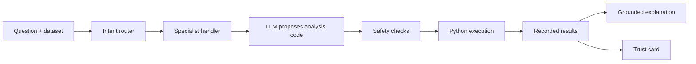

# InsightForge

**An analytics assistant that runs the analysis before it explains the answer.**

[](https://github.com/salonijain279/InsightForge/actions/workflows/ci.yml)


InsightForge is a local analytics workspace for CSV and Excel data. It classifies a user's question, selects an exploratory, predictive, visualization, causal, or general workflow, executes the analysis against the uploaded data, and explains the computed output. Deterministic EDA and baseline modelling remain available without an LLM; custom questions can use OpenAI, Anthropic, or Groq.

## Why this project

Many analytics assistants can generate plausible text before an analysis has actually run. InsightForge is designed to separate planning from evidence: it executes Python first, records the real tables, metrics, and charts, and only then grounds the explanation in those outputs. For causal questions, it also surfaces the method, assumptions, and limitations instead of presenting an estimate as fact.

## What it does

- Upload a CSV or Excel file, or start with a bundled sample dataset.
- Generate a full EDA profile and data-quality summary without an API call.
- Train a deterministic baseline and simple predictive model.
- Route natural-language questions to specialized analysis handlers.
- Execute generated Python through an AST safety gate and restricted namespace.
- Retry once with the real error when generated code fails.
- Preserve charts and tables across Streamlit reruns.
- Produce evidence-linked explanations, trust cards, and a downloadable session report.

## How it works



The router uses a keyword fast path for clear requests and calls the configured model only when classification is ambiguous. Generated code receives a curated analytics namespace rather than unrestricted Python access. The displayed explanation is produced after execution from the actual recorded output.

## Quick start

```bash
git clone https://github.com/salonijain279/InsightForge.git
cd InsightForge

python3 -m venv .venv
source .venv/bin/activate
pip install -r requirements.txt

cp .env.example .env
streamlit run app.py
```

Configure one provider in `.env` for chat-driven analysis:

```dotenv
MODEL_PROVIDER=groq
GROQ_API_KEY=your_key_here
```

Supported values for `MODEL_PROVIDER` are `openai`, `anthropic`, and `groq`. Deterministic EDA and baseline modelling remain available without a provider key.

## Try it

1. Select **Store sales campaign** or upload your own tabular dataset.
2. Run the full EDA profile.
3. Choose a target and train the baseline model.
4. Ask questions such as:
   - `Show me a bar chart of average sales by region.`
   - `Build a model to predict sales.`
   - `What was the effect of the campaign on sales?`
5. Inspect the executed code, computed output, and trust card.
6. Download the session report.

## Verification

Install the test dependency and run both verification layers:

```bash
pip install -r requirements-dev.txt
pytest -q
python eval_suite.py
```

The test suite covers routing, deterministic modelling, provider wrappers, safe execution, report generation, trust cards, causal-method recovery, and cross-domain generalization. The batch evaluation runs ten representative questions through the pipeline, including typo recovery and an adversarial unsafe-code case.

## Repository map

| Path | Responsibility |
|---|---|
| `app.py` | Streamlit interface and session state |
| `router.py` | Intent classification and fallback routing |
| `handlers/` | Analysis-specific instructions for EDA, prediction, visualization, and causal work |
| `pipeline.py` | Route, generate, execute, retry, and ground the answer |
| `safe_exec.py` | AST checks and restricted builtins for generated code |
| `exec_namespace.py` | Curated pandas, NumPy, Plotly, scikit-learn, and statsmodels tools |
| `deterministic.py` | Zero-LLM baseline modelling |
| `report.py` | EDA and downloadable report generation |
| `tests/` | Automated regression and generalization tests |
| `docs/` | Development notes and evaluation artifacts |

## Safety and analytical limits

- The AST scan and restricted builtins reduce accidental risk; they are not a security sandbox. Run the app locally and do not expose generated-code execution as a multi-tenant service without process or container isolation.
- The signal-based timeout works in direct script execution but is not enforceable inside Streamlit's worker thread.
- A statistically valid computation can still be the wrong method for the business question.
- Causal estimates require defensible identification assumptions. The trust card makes those assumptions visible; it does not prove them.
- The downloadable report captures textual output, while interactive chart state remains in the running application.

For the design decisions, failures, and fixes behind the system, see [development notes](docs/development-notes.md).
